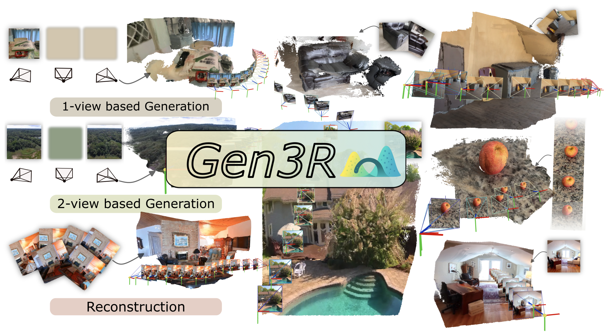

<div align="center">
<h1>
Gen3R: 3D Scene Generation Meets Feed-Forward Reconstruction
</h1>

[Jiaxin Huang](https://jaceyhuang.github.io/), [Yuanbo Yang](https://github.com/freemty), [Bangbang Yang](https://ybbbbt.com/), [Lin Ma](https://scholar.google.com/citations?user=S4HGIIUAAAAJ&hl=en),  [Yuewen Ma](https://scholar.google.com/citations?user=VG_cdLAAAAAJ), [Yiyi Liao](https://yiyiliao.github.io/)

<a href="https://xdimlab.github.io/Gen3R/"></a>
<a href="https://arxiv.org/abs/2601.04090"></a>
<a href="https://huggingface.co/JaceyH919/Gen3R"></a>

<p align="center">
  <a href="">
    
  </a>
</p>

<p align="left">
<strong>TL;DR</strong>: Gen3R creates multi-quantity geometry with RGB from images via a unified latent space that aligns geometry and appearance.
</p>

</div>

## 🛠️ Setup
We train and test our model under the following environment: 
- Debian GNU/Linux 12 (bookworm)
- NVIDIA H20 (96G)
- CUDA 12.4
- Python 3.11
- Pytorch 2.5.1+cu124


1. Clone this repository
```bash
git clone https://github.com/JaceyHuang/Gen3R
cd Gen3R
```
2. Install packages
```bash
conda create -n gen3r python=3.11.2 -y
conda activate gen3r
pip install -r requirements.txt
```
3. (**Important**) Download pretrained Gen3R checkpoint from [HuggingFace](https://huggingface.co/JaceyH919/Gen3R) to ./checkpoints
```bash
sudo apt install git-lfs
git lfs install
git clone https://huggingface.co/JaceyH919/Gen3R ./checkpoints
```
- **Note:** At present, direct loading weights from HuggingFace via `from_pretrained("JaceyH919/Gen3R")` is not supported due to module naming errors. Please download the model checkpoint **locally** and load it using `from_pretrained("./checkpoints")`.

## 🚀 Inference
Run the python script `infer.py` as follows to test the examples
```bash
python infer.py \
    --pretrained_model_name_or_path ./checkpoints \
    --task 2view \
    --prompts examples/2-view/colosseum/prompts.txt \
    --frame_path examples/2-view/colosseum/first.png examples/2-view/colosseum/last.png \
    --cameras free \
    --output_dir ./results \
    --remove_far_points
```
Some important inference settings below:
- `--task`: `1view` for `First Frame to 3D`, `2view` for `First-last Frames to 3D`, and `allview` for `3D Reconstruction`.
- `--prompts`: the text prompt string or the path to the text prompt file.
- `--frame_path`: the path to the conditional images/video. For the `allview` task, this can be either the path to a folder containing all frames or the path to the conditional video. For the other two tasks, it should be the path to the conditional image(s).
- `--cameras`: the path to the conditional camera extrinsics and intrinsics. We also provide basic trajectories by specifying this argument as `zoom_in`, `zoom_out`, `arc_left`, `arc_right`, `translate_up` or `translate down`. In this way, we will first use [VGGT](https://github.com/facebookresearch/vggt) to estimate the initial camera intrinsics and scene scale. To disable camera conditioning, set this argument to `free`.

Note that the default resolution of our model is 560×560. If the resolution of the conditioning images or videos differs from this, we first apply resizing followed by center cropping to match the required resolution.

### More examples
<details>
<summary>Click to expand</summary>

- **First Frame to 3D**

```bash
python infer.py \
    --pretrained_model_name_or_path ./checkpoints \
    --task 1view \
    --prompts examples/1-view/prompts.txt \
    --frame_path examples/1-view/knossos.png \
    --cameras zoom_out \
    --output_dir ./results
```

- **First-last Frames to 3D**

```bash
python infer.py \
    --pretrained_model_name_or_path ./checkpoints \
    --task 2view \
    --prompts examples/2-view/bedroom/prompts.txt \
    --frame_path examples/2-view/bedroom/first.png examples/2-view/bedroom/last.png\
    --cameras examples/2-view/bedroom/cameras.json \
    --output_dir ./results
```

- **3D Reconstruction**, note that `--cameras` are ignored in this task.

```bash
python infer.py \
    --pretrained_model_name_or_path ./checkpoints \
    --task allview \
    --prompts examples/all-view/prompts.txt \
    --frame_path examples/all-view/garden.mp4 \
    --output_dir ./results
```
</details>

## 🚗 Training

Gen3R training consists of two stages as described in the [paper](https://arxiv.org/abs/2601.04090):

### Training Overview

**Stage 1: Train Geometry Adapter**
- Train an adapter to map VGGT tokens to a latent space aligned with the Wan VAE's appearance latent space
- Optimizes reconstruction loss (L_rec) and distribution alignment loss (L_KL)
- Initial training with 25 frames, fine-tuning with 49 frames

**Stage 2: Fine-tune Video Diffusion Model**
- Fine-tune the video diffusion model to jointly generate appearance and geometry latent codes
- Operates on concatenated latent space Z = [A; G]
- Supports multiple conditioning tasks (1-view, 2-view, all-view)

### Dataset Preparation

Prepare your dataset in the following structure:
```
data/
├── train/
│   ├── scene_001/
│   │   ├── frames/           # Video frames (PNG/JPG)
│   │   │   ├── 0000.png
│   │   │   ├── 0001.png
│   │   │   └── ...
│   │   ├── cameras.json      # Camera parameters
│   │   ├── depth/            # (Optional) Depth maps
│   │   └── prompt.txt        # Text description
│   ├── scene_002/
│   └── ...
└── val/
    └── ...
```

The `cameras.json` should contain:
```json
{
    "extrinsics": [[4x4 matrix], ...],
    "intrinsics": [[3x3 matrix], ...]
}
```

Supported datasets (as per the paper):
- RealEstate10K
- DL3DV-10K
- Co3Dv2
- WildRGB-D
- TartanAir

### Quick Start

Run the full training pipeline:
```bash
# Set environment variables
export DATA_ROOT=/path/to/your/data
export CHECKPOINTS_DIR=./checkpoints
export OUTPUT_DIR=./outputs

# Run training
bash train.sh
```

### Stage 1: Train Geometry Adapter

```bash
python train_adapter.py \
    --data_root /path/to/data \
    --vggt_path ./checkpoints/vggt \
    --wan_vae_path ./checkpoints/wan_vae \
    --output_dir ./outputs/geometry_adapter \
    --num_epochs 100 \
    --batch_size 1 \
    --learning_rate 1e-4 \
    --num_frames 25 \
    --resolution 560 \
    --lambda_rec 1.0 \
    --lambda_kl 0.001 \
    --mixed_precision bf16
```

Key arguments:
- `--num_frames`: Number of frames per sequence (use 25 for initial training, 49 for fine-tuning)
- `--lambda_rec`: Weight for reconstruction loss (default: 1.0)
- `--lambda_kl`: Weight for KL divergence loss (default: 0.001)

### Stage 2: Fine-tune Diffusion Model

```bash
python train_diffusion.py \
    --data_root /path/to/data \
    --pretrained_path ./checkpoints \
    --output_dir ./outputs/diffusion \
    --num_epochs 50 \
    --batch_size 1 \
    --learning_rate 1e-5 \
    --num_frames 49 \
    --resolution 560 \
    --text_dropout_prob 0.1 \
    --camera_dropout_prob 0.1 \
    --task_1view_prob 0.4 \
    --task_2view_prob 0.3 \
    --task_allview_prob 0.3 \
    --mixed_precision bf16
```

Key arguments:
- `--text_dropout_prob`: Probability of dropping text conditioning (for classifier-free guidance)
- `--camera_dropout_prob`: Probability of dropping camera conditioning
- `--task_*_prob`: Sampling probabilities for different tasks (1-view, 2-view, all-view)

### Hardware Requirements

By default, we train our models using 24 H20 GPUs (96 GB VRAM each). However, the models can also be trained on other GPU configurations by appropriately adjusting the batch size:

- **Recommended**: 8x H100 (80GB) or equivalent
- **Minimum**: 1x GPU with 40GB+ VRAM (with reduced batch size)

### Using Trained Models

After training, use your trained model for inference:
```bash
python infer.py \
    --pretrained_model_name_or_path ./outputs/diffusion/final_pipeline \
    --task 2view \
    --prompts "A beautiful scene" \
    --frame_path image1.png image2.png \
    --cameras free \
    --output_dir ./results
```

## ✅ TODO
- [x] Release inference code and checkpoints
- [x] Release training code
- [ ] Release online demo
- [ ] Release dataset preparation scripts

## 🎓 Citation
Please cite our paper if you find this repository useful:

```bibtex
@misc{huang2026gen3r3dscenegeneration,
      title={Gen3R: 3D Scene Generation Meets Feed-Forward Reconstruction}, 
      author={Jiaxin Huang and Yuanbo Yang and Bangbang Yang and Lin Ma and Yuewen Ma and Yiyi Liao},
      year={2026},
      eprint={2601.04090},
      archivePrefix={arXiv},
      primaryClass={cs.CV},
      url={https://arxiv.org/abs/2601.04090}, 
}
```